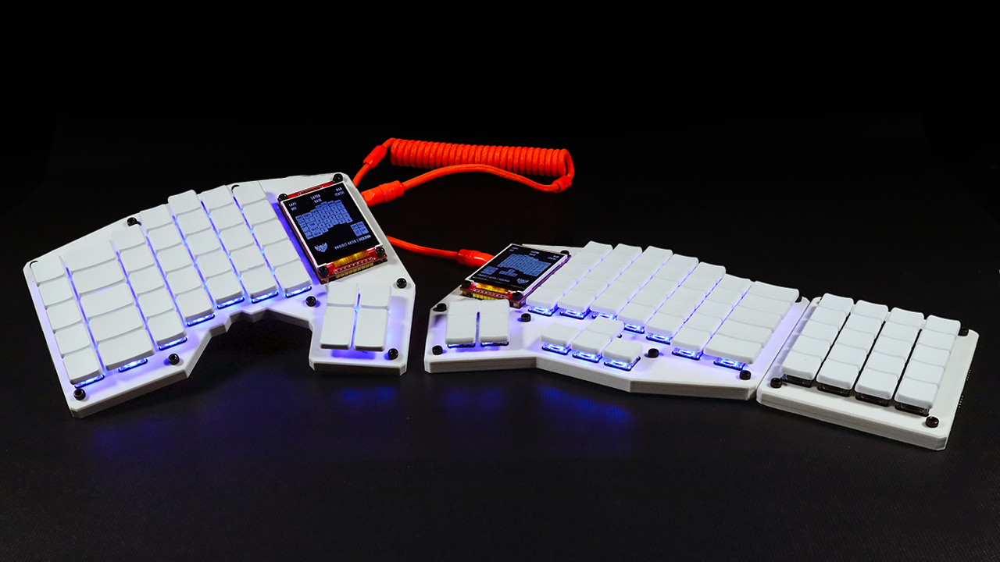
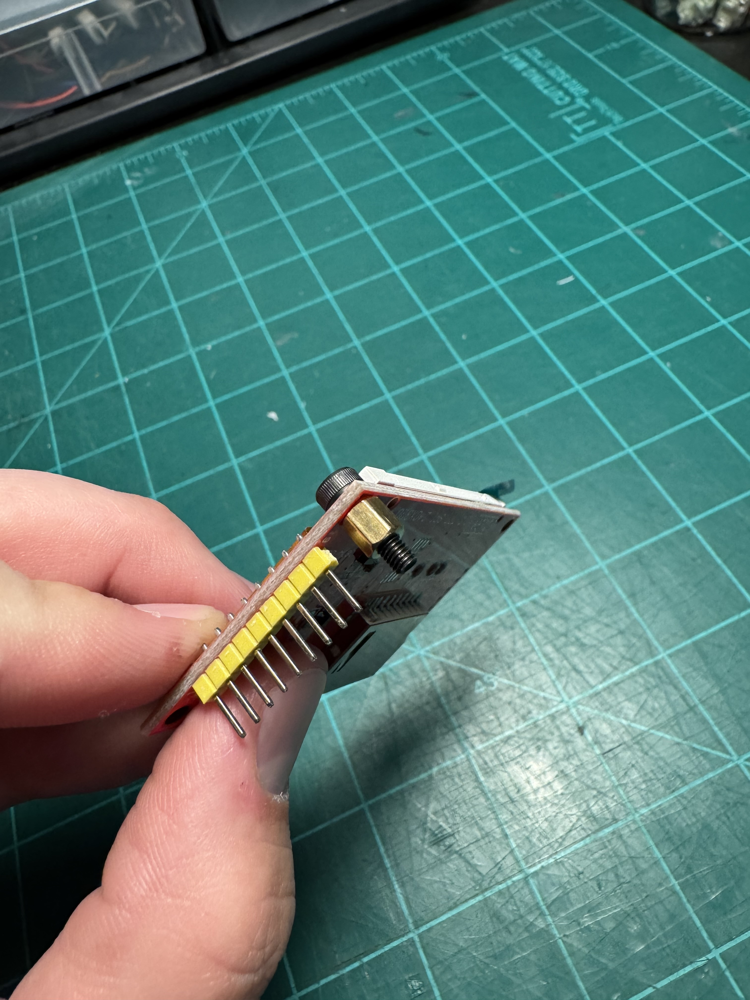
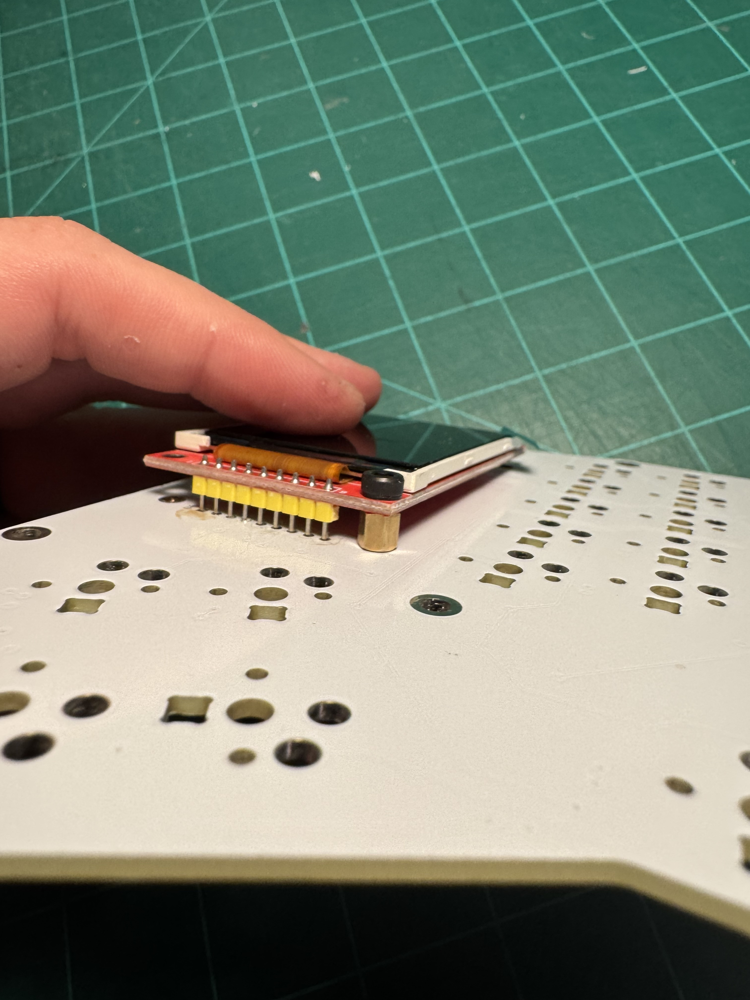
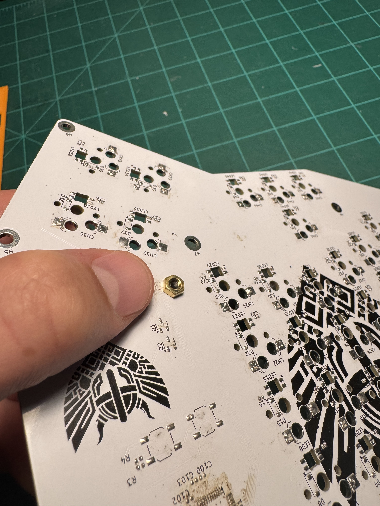

# Split Keyboard Mk. I - Instructions

----
<span class="label label-yellow">This Page is a Work In Progress | Check Back Soon</span>


This is my very first split keyboard build ever, and while it's far from perfect, it was an amazing learning experience. 

<span class="label label-yellow">Disclaimer:</span>
>This DIY split keyboard PCB was designed for personal use and is shared as-is. While it works well for me, it's not a professionally validated design—there ~~may~~will be be imperfections or quirks. If you decide to build it, please do so at your own risk. Double-check everything, and make modifications as needed. Happy building!

# Requirements
To complete this build, you'll need the following:
### Required
- 3d Printer or ability to get 3d printed parts
- Soldering Iron
- Computer

### Optional
- Hot air soldering station
	- Alt. is to order your PCB's assembled

# 3D Models
I have included a link to the 3D models on Printables for you to download and print, but in case the tolerances aren't correct for your printer, I have also included the Fusion360 project so you can adjust them yourself. 
- [Printables](https://www.printables.com/model/1303280-custom-split-keyboard-case)
- Fusion360 Projects
	- Right - https://a360.co/4jo1lfW
	- Left - https://a360.co/3HjPXUH
	- Numpad - https://a360.co/3FjKqgo

# PCB

<span class="label">Use this link to get $5 off your first order!</span> - https://pcbway.com/g/F41R62

- [PCBWay Project](https://www.pcbway.com/project/shareproject/Modular_Split_Mechanical_Keyboard_7a8f16f0.html) - You can order it directly from here, and even have it assembled. PCBWay requires each board to be a separate project, so the three are separate:
	- [Right](https://www.pcbway.com/project/shareproject/Modular_Split_Mechanical_Keyboard_7a8f16f0.html)
	- [Left](https://www.pcbway.com/project/shareproject/Module_Split_Mechanical_Keyboard_Left_Half_f05e1cac.html)
	- [Numpad](https://www.pcbway.com/project/shareproject/Modular_Split_Mechanical_Keyboard_Numpad_5ea6c1e4.html)
- [KiCAD Project](https://github.com/modern-hobbyist/aesir/tree/main/hermod) - In case you need to reference the PCB or Schematic during the soldering process.
- [PCB BOM](https://www.digikey.com/en/mylists/list/8VSL0OSHL7) - If anything is missing from this list please contact me on Discord so I can update it!

> Note: The PCB Projects do not include the LCD Displays, the Magnetic Pogo Connectors or the Hot Swap sockets. I found it much cheaper and easier to do that myself so they aren't included in the PCB BOM or the centroid file (the pick and place file)
# Hardware BOM

| Item                            | Description                                                    | Qty | Qty/ Pack | Unit Price | Extended Price USD | Link                                                                                                                                      |
| ------------------------------- | -------------------------------------------------------------- | --- | --------- | ---------- | ------------------ | ----------------------------------------------------------------------------------------------------------------------------------------- |
| USB_C_Receptacle_USB2.0         | HRO Koreaparts M-14 mid-mount USB-C 2.0                        | 4   | 5         | $1.65      | $1.65              | [Link](https://www.lcsc.com/product-detail/USB-Connectors_Korean-Hroparts-Elec-TYPE-C-31-M-14_C223907.html)                               |
| Magnetic Pogo Connectors        | 4 sets of male+female                                          | 4   | 1         | $1.91      | $7.64              | [Link](https://www.aliexpress.us/item/3256807450239540.html?spm=a2g0o.order_list.order_list_main.5.65051802pm4kbe&gatewayAdapt=glo2usa)   |
| 2.2" LCD Display - No Touch     | This keyboard uses the 2.2 No touch                            | 2   | 1         | $4.85      | $9.70              | [Link](https://www.aliexpress.us/item/2255800032844649.html?spm=a2g0o.order_list.order_list_main.105.65051802pm4kbe&gatewayAdapt=glo2usa) |
| Choc Hot Swap Sockets - 1u      | These are for both the 1u and 1.5u switches.                   | 102 | 110       | $12.88     | $12.88             | [Link](https://www.aliexpress.us/item/3256805821531402.html?spm=a2g0o.order_list.order_list_main.59.65051802pm4kbe&gatewayAdapt=glo2usa)  |
| Kailh Choc Low Profile Switches | The actual switches that plug into the Hot Swap sockets above. | 102 | 110       | $54.82     | $54.82             | [Link](https://www.aliexpress.us/item/3256804880270570.html?spm=a2g0o.order_list.order_list_main.90.22b51802WAWGdO&gatewayAdapt=glo2usa)  |
| 1u Keycaps                      |                                                                | 86  | 50        | $25.06     | $50.12             | [Link](https://www.aliexpress.us/item/3256804371784456.html?spm=a2g0o.order_list.order_list_main.181.4e5218021PwPwR&gatewayAdapt=glo2usa) |
| 1u Homing Keycaps               |                                                                | 2   | 2         | $3.49      | $3.49              | [Link](https://www.aliexpress.us/item/3256804593704786.html?spm=a2g0o.order_list.order_list_main.80.22b51802fUmZ3v&gatewayAdapt=glo2usa)  |
| 1.5u Keycaps                    | 2 Pack                                                         | 14  | 2         | $3.55      | $24.85             | [Link](https://www.aliexpress.us/item/3256804593704786.html?spm=a2g0o.order_list.order_list_main.80.22b51802fUmZ3v&gatewayAdapt=glo2usa)  |
| M3x8mm Bolts                    | M3x8mm                                                         | 22  | 1         | $0.12      | $2.64              | [Link](https://boltdepot.com/Product-Details?product=13635)                                                                               |
| M3x3mm Heat Set Inserts         | M3x3mm - Pack of 50                                            | 22  | 50        | $0.12      | $2.62              | [Link](https://www.adafruit.com/product/4256)                                                                                             |
| Poron Foam - 3mm                | 50X15X0.3CM                                                    | 1   | 1         | $5.69      | $5.69              | [Link](https://www.aliexpress.us/item/3256804497716681.html?spm=a2g0o.order_list.order_list_main.112.263f18022PcLB8&gatewayAdapt=glo2usa) |
| M3x5mm Standoff                 | M3x5mm                                                         | 8   | 25        | $8.39      | $2.68              | [Link](https://a.co/d/9zuHsuM)                                                                                                            |
| M3x10mm Hex Head bolts          | M3x5mm                                                         | 8   | 1         | $0.12      | $0.96              | [Link](https://boltdepot.com/Product-Details?product=13636)                                                                               |
| M3 Nuts                         | M3                                                             | 8   | 1         | $0.07      | $0.56              | [Link](https://boltdepot.com/Product-Details?product=4773)                                                                                |

# Building

### PCB Assembly

<span class="label label-yellow">Work in Progress</span>
There isn't really any information regarding the PCB Assembly process, other than to provide a few tips that helped me along the way. I am far from an expert when it comes to SMD soldering, as evidenced by my sub-par soldering job in the video, but I did recently learn how to do it, so I can at least give beginner advice.

1. Install the [Interactive HTML BOM](https://github.com/openscopeproject/InteractiveHtmlBom) plugin in KiCad
	- Will allow you to see quickly see what each component on the PCB is, which I found invaluable during my solder process.
2. Practice on a test PCB or *at least* don't start with the MCU
	- I started with the MCU (bad), which has the tiniest pins of all the components, and that was a mistake.
	- I should have gotten some practice in by doing the LED caps or switch diodes--something cheap and simple.
3. Order assembly from PCBWay using the Project link above.
4. Whether you order from PCBWay or solder yourself, you'll likely still need to install the LCD's manually
	- Start by installing the 5mm standoffs to the display with the M3x10mm bolts
	  <p align="center">
		  
		</p>
	  
	- Install the display onto the PCB. You may need to "thread" the bolts through the PCB bolt holes, depending on the manufacturers tolerances.
	  <p align="center">
		  
		</p>
	- Thread the M3 nuts onto the M3x10mm bolts that protrude under the PCB
	  <p align="center">
		  
		</p>
	- Solder the LCD into place

### Assembly

1. 3d Prints
   Start by printing out all the parts listed in the [Printables](<[Printables](https://www.printables.com/model/1303280-custom-split-keyboard-case)>) project. All the parts will fit easily on a standard 200mm x 200mm 3d printer bed and shouldn't need any supports. I used the following parameters
	- PLA
	- 0.15mm Layer Height
	- 50% infill
	- 4 perimeter walls
2. Poron Foam
   While this step is not strictly necessary, I found it did help a bit with the overall sound of the Keyboard. 
	- There is a model in the Printables link for 3mm foam to sit between the bottom of the case and the PCB. 
	- You can either use this model to laser cut the poron foam listed in the BOM, or print out the model as a template and use it to cut the poron by hand
3. Heat-set Inserts
	- To mount the top half of the case to the bottom, you'll need to install 9 heat set inserts into the bottom half of the case
	- This is easiest to do by heating the insert with a soldering iron and slowly pressing it into place
4. Assemble Case
	- Mount the top half of the case to the base with the M3x8mm bolts
5. Install switches!

### Firmware

Please keep in mind that you will still need to customize the firmware to some degree. The current layout of this keyboard isn't for everyone, and the displays show images of my Keymap. 

- [Vanilla Hermod Firmware](https://github.com/modern-hobbyist/qmk_firmware/tree/modhobbyist/keyboards/aesir/hermod) 
	- Base Firmware to get you started. No display animations or sleep timers. Pretty basic, but gives you full control over what you do with the firmware.
- [Userspace Valhalla Firmware](https://github.com/modern-hobbyist/qmk_userspace/tree/main/keyboards/aesir/hermod/keymaps/valhalla)
	- Pretty much what I run normally, without my custom macros. 

If you find yourself needing to customize the displays, macros, activity timeouts or anything else QMK Specific, either check out the QMK Docs or reach out to someone on the QMK Discord.

- [QMK Docs](https://docs.qmk.fm/)
- [QMK Discord](https://discord.com/invite/qmk)

You can also reach out on my [Discord](https://discord.gg/68WXGsjqJp), though I likely won't be much help to you, as I barely scraped this together.

### Updating LCD Layer Images

To summarize the steps to update the layer images for the LCDs:

1. Update the Photoshop file for the layer you want to update (in `qmk_userspace/layouts`
2. Export Photoshop file as PNG
3. Convert the PNG to a QGF File format using `qmk painter-convert-graphics` command
4. Overwrite or add the new QGF file to your `keymap.c` and render it when/where you want.

In the keymap.c file in my QMK Userspace, I include a few different files for each of the keymap layers I use. For now, I only use 2 layers, but with a split keyboard that comes out to 4 image files that need drawn to the LCDs. The current files are included at the top of `keymap.c` and are as follows:

```
#include "./graphics/left-base-layout.qgf.h"
#include "./graphics/right-base-layout.qgf.h"
#include "./graphics/left-1-layout.qgf.h"
#include "./graphics/right-1-layout.qgf.h"
```

If you want to replace the images with your own custom layout, there are some Photoshop files in the `qmk_userspace/layouts` directory that you can edit. I found it easiest to edit the keymap in Photoshop or another editor of your choice to set the text for each key on each layer, then export it as a PNG.

Once you have updated the Photoshop files to have the proper text for each key in the layer you're working on and exported them as PNG's, move them to the `qmk_userspace/layouts` directory (proper file management is important!) and open up a `terminal`.

In your terminal, navigate to that `qmk_userspace/layouts` directory and run the following command to convert the PNG to a QGF format (results in a .c and a .h file).

```
qmk painter-convert-graphics -i base/left-base-layout.png -o output -f pal4
```

Replace the input (in this case `base/left-base-layout.png`) with the PNG you created earlier, and replace the output (in this case the `output` directory inside `qmk_userspace/layouts`) with the output directory you want to use. Or keep it the same as me and simplify your life.

`pal4` is the color format, in this case a 4-color palette.

The above command will convert the input file to a `.c` and `.h` file with the same name as the input PNG and move it to the output file you specified. 

From there, you can import the .h file in your keymap and render it as you please.

**Couple Notes:**
1. Try not to force the screen to re-render too much, the MCU isn't very powerful and you'll bog down your keyboard to the point where it's not usable.
	1.  To help with this, I only update the entire image when I hold down a specific key, NOT every time I change layers.
2. Here is a link to the Quantum Painter docs: [https://docs.qmk.fm/quantum_painter#quantum-painter](https://docs.qmk.fm/quantum_painter#quantum-painter)

# Resources
## Absolute TOP resources:
- [Keyboard Layout Editor](https://www.keyboard-layout-editor.com/)
- [Keyboard Atelier](https://kbatelier.org/)
- [QMK Firmware](https://docs.qmk.fm/),  [QMK Discord](https://discord.com/invite/qmk)
- [Noah Kiser's STM32F072 Template](https://github.com/NCKiser/STM32F072_template)
- [AIO3 Plate Generator](https://kbplate.ai03.com/)
- [KBPlacer Plugin for KiCAD](https://github.com/adamws/kicad-kbplacer)

## Everything else
Below is a list of every single link I saved during the building of this keyboard. It might not be complete, and it might actually be a little bit overwhelming, but they were each helpful to me in some way, so I figured better safe than sorry and included them all!

- [https://github.com/ruiqimao/keyboard-pcb-guide?tab=readme-ov-file#setting-up](https://github.com/ruiqimao/keyboard-pcb-guide?tab=readme-ov-file#setting-up)
- [https://github.com/tmk/kicad_lib_tmk](https://github.com/tmk/kicad_lib_tmk)
- [https://github.com/tmk/keyboard_parts.pretty](https://github.com/tmk/keyboard_parts.pretty)
- [https://github.com/egladman/keebs.pretty](https://github.com/egladman/keebs.pretty)[https://www.reddit.com/r/MechanicalKeyboards/comments/5nzpd2/guide_how_to_make_your_own_keyboard_pcb/](https://www.reddit.com/r/MechanicalKeyboards/comments/5nzpd2/guide_how_to_make_your_own_keyboard_pcb/)
- [https://i.imgur.com/ajqxJWz.png](https://i.imgur.com/ajqxJWz.png)
- [https://www.youtube.com/watch?v=7azQkSu0m_U](https://www.youtube.com/watch?v=7azQkSu0m_U)
- [https://www.youtube.com/watch?v=iznKltVU1yw](https://www.youtube.com/watch?v=iznKltVU1yw)
- [https://www.youtube.com/watch?v=kGKN8SGkUD0](https://www.youtube.com/watch?v=kGKN8SGkUD0)
- [https://github.com/Zambumon/SKUF](https://github.com/Zambumon/SKUF)
- [https://maxkeyboard.com/ansi-layout-custom-color-cherry-mx-keycap-set.html](https://maxkeyboard.com/ansi-layout-custom-color-cherry-mx-keycap-set.html)
- [https://yuzukeycaps.com/](https://yuzukeycaps.com/)
- [https://amzn.to/3XczB5T](https://amzn.to/3XczB5T)
- [https://keyboard-tools.xyz/](https://keyboard-tools.xyz/)
- [https://docs.qmk.fm/custom_quantum_functions](https://docs.qmk.fm/custom_quantum_functions)
- [https://github.com/getreuer/qmk-keymap?tab=readme-ov-file](https://github.com/getreuer/qmk-keymap?tab=readme-ov-file)
- [https://plate.keeb.io/](https://plate.keeb.io/)[https://discord.com/channels/728571839529353216/1040846204856193154/1040846268945145866](https://discord.com/channels/728571839529353216/1040846204856193154/1040846268945145866)
- [https://hackaday.com/2023/08/07/all-about-usb-c-example-circuits/](https://hackaday.com/2023/08/07/all-about-usb-c-example-circuits/)
- [https://github.com/daprice/keyswitches.pretty?tab=readme-ov-file](https://github.com/daprice/keyswitches.pretty?tab=readme-ov-file)
- [https://kicanvas.org/](https://kicanvas.org/)
- [https://www.etsy.com/listing/549370705/custom-sublimation-transfers-sizes-up-to?ref=yr_purchases](https://www.etsy.com/listing/549370705/custom-sublimation-transfers-sizes-up-to?ref=yr_purchases)
- [https://github.com/Maximillian/keycap-set-templates?tab=readme-ov-file](https://github.com/Maximillian/keycap-set-templates?tab=readme-ov-file)
- [https://www.reddit.com/r/olkb/comments/1bvyo0j/oled_screen_wont_work_qmk/](https://www.reddit.com/r/olkb/comments/1bvyo0j/oled_screen_wont_work_qmk/)
- [https://github.com/kitspace/awesome-electronics](https://github.com/kitspace/awesome-electronics)
- [https://blog.keeb.io/getting-the-iris-ce-compact-edition-ready-for-you/](https://blog.keeb.io/getting-the-iris-ce-compact-edition-ready-for-you/)